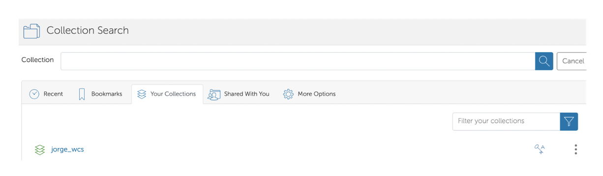

# Docker Installation Guide for MacOS, Windows, and Linux

[Wellcome Connecting Science GitHub Home Page](https://github.com/WCSCourses) <br /> 
[Wellcome Connecting Science Website](https://coursesandconferences.wellcomeconnectingscience.org/)

## Table of Contents
- [Introduction](#introduction)
- [Prerequisites](#prerequisites)
- [Docker Installation on macOS](#docker-installation-on-macos)
  - [1. Download Docker Desktop](#1-download-docker-desktop)
  - [2. Install Docker Desktop](#2-install-docker-desktop)
  - [3. Start Docker](#3-start-docker)
  - [4. Verify Installation](#4-verify-installation)
- [Docker Installation on Windows](#docker-installation-on-windows)
  - [1. Download Docker Desktop](#1-download-docker-desktop-1)
  - [2. Install Docker Desktop](#2-install-docker-desktop-1)
  - [3. Verify Installation](#3-verify-installation)
  - [4. Run a Test Container](#4-run-a-test-container)
- [Docker Installation on Linux](#docker-installation-on-linux)
  - [1. Update Your Package Database](#1-update-your-package-database)
  - [2. Install Prerequisites](#2-install-prerequisites)
  - [3. Add Docker’s GPG Key](#3-add-dockers-gpg-key)
  - [4. Set Up the Stable Repository](#4-set-up-the-stable-repository)
  - [5. Install Docker](#5-install-docker)
  - [6. Add Your User to the Docker Group (Optional but Recommended)](#6-add-your-user-to-the-docker-group-optional-but-recommended)
  - [7. Verify Installation](#7-verify-installation)
  - [8. Run a Test Container](#8-run-a-test-container)
-  [Downloading Docker Image/File via Globus](#downloading-docker-imagefile-via-globus)  
-  [Globus Downloading Steps](#globus-downloading-steps)  
   - [1. Create a Globus Connect Personal Account](#1-create-a-globus-connect-personal-account)  
   - [2. Download the Globus Client](#2-download-the-globus-client)  
   - [3. Open Globus File Manager](#3-open-globus-file-manager)  
   - [4. Find Your Files](#4-find-your-files)  
   - [5. Search for WCS Endpoint](#5-search-for-wcs-endpoint)  
   - [6. Transfer the VM](#6-transfer-the-vm)  
   - [7. Choose Local Endpoint](#7-choose-local-endpoint)  
   - [8. Start the Download](#8-start-the-download)  
   - [9. Wait for Completion](#9-wait-for-completion)  
   - [10. Build the Docker Image](#10-build-the-docker-image)  
   - [11. Run the Container](#11-run-the-container)  
-  [Additional Resources and Troubleshooting for Globus](#additional-resources-and-troubleshooting-for-globus)  

- [Additional Resources](#additional-resources)

## Introduction
Docker is a platform that allows you to develop, ship, and run applications inside containers. Containers are lightweight and executable packages of software that include everything needed to run an application: code, runtime, system tools, libraries, and settings. This guide will walk you through the installation process of Docker on macOS, Windows, and Linux.

## Prerequisites
Before installing Docker, ensure your system meets the following requirements:

- **macOS**: macOS 10.15 or newer.
- **Windows**: Windows 10 64-bit: Pro, Enterprise, or Education (Build 19041 or higher).
- **Linux**: A 64-bit distribution running kernel version 3.10 or higher.

## Docker Installation on macOS

### 1. Download Docker Desktop
- Visit the [Docker Desktop for Mac](https://www.docker.com/products/docker-desktop) page.
- Click on "Download for Mac" to get the installer.

### 2. Install Docker Desktop
- Once the `.dmg` file is downloaded, double-click it to open.
- Drag the Docker icon to the Applications folder.

### 3. Start Docker
- Open the Docker application from the Applications folder.
- Docker will launch and ask for system permissions to install components.
- Enter your system password when prompted.

### 4. Verify Installation
- Open a terminal and run the command:
  ```bash
  docker --version
    ```

---

## Docker Installation on Windows

### 1. Download Docker Desktop
- Visit the [Docker Desktop for Windows](https://www.docker.com/products/docker-desktop) download page.
- Click on the "Download for Windows" button.

### 2. Install Docker Desktop
- Run the installer and follow the on-screen instructions.
- Make sure to enable the option to use WSL 2 (Windows Subsystem for Linux) during the installation process.

### 3. Verify Installation
- Open Command Prompt or PowerShell and run:
    ```bash
    docker --version
    ```
- This should return the version of Docker installed.

### 4. Run a Test Container
- To verify Docker is working correctly, run:
    ```bash
    docker run hello-world
    ```
- This command downloads and runs a simple container that outputs a confirmation message.

---

## Docker Installation on Linux

### 1. Update Your Package Database
- Open a terminal and run:
    ```bash
    sudo apt-get update
    ```

### 2. Install Prerequisites
- Install necessary packages to allow apt to use a repository over HTTPS:
    ```bash
    sudo apt-get install apt-transport-https ca-certificates curl software-properties-common
    ```

### 3. Add Docker’s GPG Key
- Add Docker’s official GPG key:
    ```bash
    curl -fsSL https://download.docker.com/linux/ubuntu/gpg | sudo gpg --dearmor -o /usr/share/keyrings/docker-archive-keyring.gpg
    ```

### 4. Set Up the Stable Repository
- Use the following command to set up the stable repository:
    ```bash
    echo "deb [arch=amd64 signed-by=/usr/share/keyrings/docker-archive-keyring.gpg] https://download.docker.com/linux/ubuntu $(lsb_release -cs) stable" | sudo tee /etc/apt/sources.list.d/docker.list > /dev/null
    ```

### 5. Install Docker
- Update the package database and install Docker:
    ```bash
    sudo apt-get update
    sudo apt-get install docker-ce docker-ce-cli containerd.io
    ```

### 6. Add Your User to the Docker Group (Optional but Recommended)
- To avoid using `sudo` for Docker commands, add your user to the `docker` group:
    ```bash
    sudo usermod -aG docker $USER
    ```
- After running this command, log out and back in, or restart your system to apply the group changes.

### 7. Verify Installation
- Check if Docker is installed correctly:
    ```bash
    docker --version
    ```

### 8. Run a Test Container
- Run the following command to ensure Docker is functioning:
    ```bash
    docker run hello-world
    ```
---

## Downloading Docker Image/File via Globus

Globus is a research-oriented file transfer tool that offers the advantage of resuming downloads from the same position in case of an internet connection failure, instead of starting over.

- **Globus Website:** [https://www.globus.org](https://www.globus.org)

## Globus Downloading Steps:

### 1. Create a Globus Connect Personal Account:
   - Visit [Globus Connect Personal](https://www.globus.org/globus-connect-personal) and select the download for your operating system (Mac or Windows). This will prompt you to create an account.
   - Choose to use Globus ID to sign in. (picture below)
   
   

   - If you don’t have an ID yet, select "Need a Globus ID? Sign up."

   

   - **IMPORTANT: Make sure to specify that it's for research or educational purposes and create your account. Remember your password for later steps.**

   

 ### 2. Download the Globus Client:
   - Download the Globus client onto your local machine (or where you intend to run the VM) and allow it to install.
   - It will ask for a collection name; give it a name you'll remember, like "home_computer" or "local_mac." This name refers to the local folders on your computer where we will send the VM in a later step.

### 3. Open Globus File Manager:
   - Click on the small "g" icon on the taskbar and select "Web: Transfer Files."
   - For Linux users: There may not be a shortcut. Start Globus Personal Connect via the command line and navigate to [https://app.globus.org/file-manager](https://app.globus.org/file-manager) to begin the file manager.

### 4. Find Your Files:
   - Your local endpoint is your computer. Click on "Collections" on the left.

### 5. Search for WCS Endpoint:
   - Search for the endpoint `wcs_data_transfers` or `wcs_data_transfers_backup`.
   - Click on the endpoint labelled `wcs_data_transfers` or `wcs_data_transfers_backup` and select "Open in File Manager."

   

### 6. Transfer the VM:
   - Select the Docker file `CourseName_Year.dockerfile` with the checkbox, then click on "Transfer or sync to."
   - In the opposite panel, click on the search box.

      

### 7. Choose Local Endpoint:
   - Click on "Your Collections" and select your local endpoint (the name will be what you gave it during the Globus Personal Connect installation).
   - You can also browse to choose the specific directory or folder on your local machine where you want the dockerfile to be downloaded.

      

### 8. Start the Download:
   - Once you have chosen the local location, click on the "Start" button under the `wcs_data_transfers` section to download to your local endpoint.

      
      

### 9. Wait for Completion:
   - Wait for the download to complete. Globus will email you once it's done, and you can track the transfer in the "Activity" menu.

### 10. Build the Docker Image
     ```bash
     docker build -t container_name .
     ```
### 11. Run the Container
     ```bash
     docker run --rm -it container_name /bin/bash
     ```
    
**Note:** The course data is also uploaded on Globus and can be searched as `CourseName_Year.dockerfile`.

## Additional Resources and Troubleshooting for Globus

- **Globus Documentation:** [https://docs.globus.org/guides/](https://docs.globus.org/guides/)
- **Stack Overflow:** [https://stackoverflow.com/](https://stackoverflow.com/) (Public Q&A platform for debugging)
- **Bioinformatics (BioStars) Forum:** [https://www.biostars.org/t/Forum/](https://www.biostars.org/t/Forum/) (General Bioinformatics queries)

---

### Additional Resources

- **[Docker Official Documentation](https://docs.docker.com/)**: Comprehensive guide and reference for Docker installation, configuration, and usage.
- **[Docker Hub](https://hub.docker.com/)**: A cloud-based registry service that allows you to link code repositories, build images, and test them.
- **[Post-Installation Steps for Linux](https://docs.docker.com/engine/install/linux-postinstall/)**: Instructions on how to manage Docker as a non-root user, including adding users to the Docker group.
- **[Docker Compose Documentation](https://docs.docker.com/compose/)**: A tool for defining and running multi-container Docker applications. Great for orchestrating multiple containers for a course.
- **[Globus](https://www.globus.org/)**: Research-oriented file transfer service that can be used to share large datasets. 
- **[VirtualBox Documentation](https://www.virtualbox.org/wiki/Documentation)**: Official documentation for using VirtualBox, useful for comparison or as an alternative.
- **[Linux Command Cheat Sheet](https://www.linuxtrainingacademy.com/linux-commands-cheat-sheet/)**: A handy reference for common Linux commands, useful for working within Docker containers.
- **[GitHub Documentation](https://docs.github.com/)**: A platform for hosting and collaborating on code, ideal for sharing course materials and Dockerfiles.

---

[Wellcome Connecting Science GitHub Home Page](https://github.com/WCSCourses) 

For more information or queries, feel free to contact us via the [Wellcome Connecting Science website](https://coursesandconferences.wellcomeconnectingscience.org).<br /> 
Find us on socials [Wellcome Connecting Science Linktr](https://linktr.ee/eventswcs)

---
