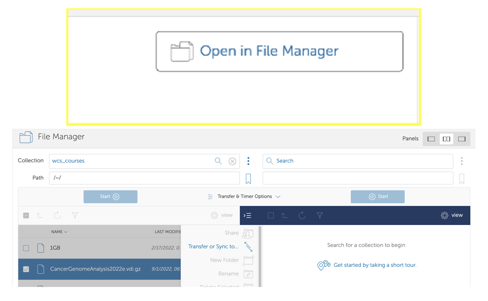

 

# ORACLE VM VIRTUAL BOX Guide

VM Installation Guide for Windows and Intel-Mac OS

# Table of Contents

- [Introduction to Virtual Box and Virtual Machine](#introduction-to-virtual-box-and-virtual-machine)
- [Host OS Requirements for Virtual Box](#host-os-requirements-for-virtual-box)
- [Installation of Virtual Box for Windows OS](#installation-of-virtual-box-for-windows-os)
- [Installation of Virtual Box for MacOS](#installation-of-virtual-box-for-macos)
- [Globus VM Downloading Steps](#globus-vm-downloading-steps)
- [Additional Resources and Troubleshooting for VM Image and Globus](#additional-resources-and-troubleshooting-for-globus)
- [Installing a Virtual Machine (VM) Image](https://github.com/WCSCourses/index/edit/main/VM_Guide.md#additional-resources-and-troubleshooting-for-virtualbox)
- [Running and Managing VMs (Optional)](https://github.com/WCSCourses/index/edit/main/VM_Guide.md#running-and-managing-vms-optional)
- [Additional Resources and Troubleshooting for Virtual Box](https://github.com/WCSCourses/index/edit/main/VM_Guide.md#additional-resources-and-troubleshooting-for-virtualbox)

## Introduction to Virtual Box and Virtual Machine

Virtual Box is a cross-platform application developed by Oracle which enables you to create Virtual Machines (VMs). The VM generates a guest operating system (such as Linux) derived from a host operating system. Therefore, sufficient RAM, processors, and memory in the host operating system are essential for smooth running of VMs.

**Note:** The VM image file (.vdi) contains all the software installed for the course.

## Host OS Requirements for Virtual Box

- RAM requirement: 8GB (preferably 12GB)
- Processor requirement: 4 processors (preferably 8)
- Hard disk space: 200GB
- Admin rights to the computer.

**Note:** Please be aware that Virtual Box is currently incompatible with M1/M2/M3 chips on MacBook. It is exclusively designed for use on Intel-based MacBooks. The current version in use is Virtual Box 7.0.

## Installation of Virtual Box for Windows OS

1. **Download VirtualBox:**
   Navigate to the official [VirtualBox website](https://www.virtualbox.org/) and go to the "Downloads" section. Choose the version that matches your Windows operating system (32-bit or 64-bit).
   
   

2. **Download Extension Pack (Optional):**
   If needed, download the VirtualBox Extension Pack from the same "Downloads" section. This pack provides additional functionalities like USB 2.0 and 3.0 support, VirtualBox Remote Desktop Protocol (VRDP), and more.

3. **Run the Installer:**
   Locate the downloaded VirtualBox installer file (.exe) and double-click to run it. Follow the on-screen instructions provided by the installer. Click "Next" to proceed through the setup wizard. You may customize installation options if desired.

4. **Install Extension Pack (Optional):**
   If you downloaded the Extension Pack, double-click on the file (e.g., Oracle_VM_VirtualBox_Extension_Pack-6.0.14-133895.vbox-extpack) to install it. This can be done after VirtualBox installation.

5. **Complete the Installation:**
   Once the installation is complete, click "Finish" to exit the installer.

## Installation of Virtual Box for MacOS

1. **Download VirtualBox:**
   Navigate to the official [VirtualBox website](https://www.virtualbox.org/) and go to the "Downloads" section. Choose the version compatible with macOS.
   
   

2. **Download Extension Pack (Optional):**
   If needed, download the VirtualBox Extension Pack from the same "Downloads" section. This pack provides additional functionalities like USB 2.0 and 3.0 support, VirtualBox Remote Desktop Protocol (VRDP), and more.

3. **Run the Installer:**
   Locate the downloaded VirtualBox installer file (.dmg) and double-click to open it. Follow the on-screen instructions to install VirtualBox on your macOS. Drag the VirtualBox icon to the Applications folder.

4. **Install Extension Pack (Optional):**
   If you downloaded the Extension Pack, double-click on the file (e.g., Oracle_VM_VirtualBox_Extension_Pack-6.0.14-133895.vbox-extpack) to install it. This can be done after VirtualBox installation.

5. **Complete the Installation:**
   Once installed, open VirtualBox from Applications folder. The first time you run it, macOS may ask for permission to run the application. Click “Open” to proceed.

## Downloading Virtual Machine (VM) Image via Globus

The Virtual Machine (VM) is a large download that many users find challenging. To address this, we use Globus software to facilitate the process. Globus is a research-oriented file transfer tool that offers the advantage of resuming downloads from the same position in case of an internet connection failure, instead of starting over.

- **Globus Website:** [https://www.globus.org](https://www.globus.org)

## Globus VM Downloading Steps:

1. **Create a Globus Connect Personal Account:**
   - Visit [Globus Connect Personal](https://www.globus.org/globus-connect-personal) and select the download for your operating system (Mac or Windows). This will prompt you to create an account.
   - Choose to use Globus ID to sign in. (picture below)
   
   

   - If you don’t have an ID yet, select "Need a Globus ID? Sign up."

   

   - **IMPORTANT: Make sure to specify that it's for research or educational purposes and create your account. Remember your password for later steps.**

   

1. **Download the Globus Client:**
   - Download the Globus client onto your local machine (or where you intend to run the VM) and allow it to install.
   - It will ask for a collection name; give it a name you'll remember, like "home_computer" or "local_mac." This name refers to the local folders on your computer where we will send the VM in a later step.

2. **Open Globus File Manager:**
   - Click on the small "g" icon on the taskbar and select "Web: Transfer Files."
   - For Linux users: There may not be a shortcut. Start Globus Personal Connect via the command line and navigate to [https://app.globus.org/file-manager](https://app.globus.org/file-manager) to begin the file manager.

3. **Find Your Files:**
   - Your local endpoint is your computer. Click on "Collections" on the left.

4. **Search for WCS Endpoint:**
   - Search for the endpoint `wcs_data_transfers`.
   - Click on the endpoint labeled `wcs_data_transfers` and select "Open in File Manager."

   

5. **Transfer the VM:**
   - Select the VM file `CourseName_Year.vdi.gz` with the checkbox, then click on "Transfer or sync to."
   - In the opposite panel, click on the search box.

      

6. **Choose Local Endpoint:**
   - Click on "Your Collections" and select your local endpoint (the name will be what you gave it during the Globus Personal Connect installation).
   - You can also browse to choose the specific directory or folder on your local machine where you want the VM to be downloaded.

      

7. **Start the Download:**
   - Once you have chosen the local location, click on the "Start" button under the `wcs_data_transfers` section to download to your local endpoint.

      
      

8. **Wait for Completion:**
   - Wait for the download to complete. Globus will email you once it's done, and you can track the transfer in the "Activity" menu.

9. **Install VirtualBox and VM:**
    - Run the installation of VirtualBox, then install the virtual machine you just downloaded.
    
**Note:** The course data is also uploaded on Globus and can be searched as `CourseName_Year.vdi.gz`.

## Additional Resources and Troubleshooting for Globus

- **Globus Documentation:** [https://docs.globus.org/guides/](https://docs.globus.org/guides/)
- **Virtual Box Documentation:** [https://www.virtualbox.org/wiki/Documentation](https://www.virtualbox.org/wiki/Documentation)
- **Virtual Box Manual:** [https://www.virtualbox.org/manual/ch01.html](https://www.virtualbox.org/manual/ch01.html)
- **Virtual Box Forum:** [https://forums.virtualbox.org/index.php](https://forums.virtualbox.org/index.php) (helpful for finding similar problem queries and solutions)
- **Stack Overflow:** [https://stackoverflow.com/](https://stackoverflow.com/) (Public Q&A platform for debugging)
- **Bioinformatics (BioStars) Forum:** [https://www.biostars.org/t/Forum/](https://www.biostars.org/t/Forum/) (General Bioinformatics queries)

---

## Installing a Virtual Machine (VM) Image

A Virtual Machine image (with a `.vdi` extension) replicates the exact VM used during the course. Downloading and installing the VM image saves time, as it contains all the necessary software and exercise data. If you're unable to find certain data, it should be available in the course GitHub repository.

**Note:** While the VM image file contains all the software installed for the course, admin rights are still required to run some sudo commands.

### Steps to Install the Virtual Machine Image:

1. **Start VirtualBox:**
   - Locate the VirtualBox shortcut on your desktop or find it in the Start Menu. Double-click the icon to launch the application.

2. **Create a Virtual Machine:**
   - In the VirtualBox Manager, click "New" to create a new virtual machine.
   - Enter a name for your virtual machine (e.g., "CourseName 2024").
   - Choose "Linux" as the type and select "Ubuntu 64-bit" as the version.
**Please Note: The vdi files are stored as `CourseName_Year.vdi.gz`. For example, we are here looking at GCM24 course.**

   

3. **Memory (RAM) Allocation:**
   - Determine the amount of RAM to allocate, keeping it close to the top of the green section on a PC.
   - Adjust the number of processors, ideally half of the available ones. Click Next when settings are configured.

   

4. **Hard Disk:**
   - Indicate the location of the virtual machine file you downloaded.
   - Choose "Use an existing virtual hard disk file," click the icon next to the menu, and add the `.vdi` file.
   - Confirm your selection in the summary window and click Finish.

   

5. **Follow Ubuntu Installation Wizard:**
   - Follow the on-screen instructions to install Ubuntu. Choose language, keyboard layout, and select "Install Ubuntu."
   - Follow the prompts for time zone, user account, and installation type.

6. **Complete Installation:**
   - Allow the installation process to complete. VirtualBox might prompt you to restart the virtual machine.
   - Double-check your choices in the confirmation window. Once satisfied, start the virtual machine by highlighting its name and clicking the "Start" icon in the manager window.

7. **Adjust Screen Size:**
   - The screen resolution should automatically adjust to match your VirtualBox window size.
   - If it doesn't, manually adjust the screen size in the Ubuntu VM:
     - Go to "Settings" > "Displays" in the Ubuntu system settings.
     - Choose the desired resolution that fits your VirtualBox window.

   

8. **Login Ubuntu:**
   - The virtual machine will go through a boot process. After a short time, a window will appear.
   - **Note:** The user account is named `manager`, and the password, if required, is also `manager`.

## Running and Managing VMs (Optional)

Adjusting the screen size in an Ubuntu virtual machine (VM) within VirtualBox involves installing and configuring the VirtualBox Guest Additions. By installing VirtualBox Guest Additions, you enable features like automatic screen resizing, improved graphics performance, and seamless mouse integration between your host machine and the Ubuntu VM.

### Steps to Adjust Screen Size:

1. **Start Ubuntu VM:**
   - Ensure that your Ubuntu VM is running.

2. **Insert Guest Additions CD:**
   - In the VirtualBox menu, go to "Devices" and choose "Insert Guest Additions CD image."
   - This action virtually inserts the Guest Additions CD into your Ubuntu VM.

3. **Open Terminal:**
   - Open a terminal window in Ubuntu by pressing `Ctrl + Alt + T` or using the application launcher.

4. **Navigate to the CD Directory:**
   - Change to the directory where the Guest Additions CD is mounted, typically located in the `/media` directory.
   - Use the following command to navigate to the directory (Note: The directory name may vary based on your VirtualBox version):
     ```bash
     cd /media/username/VBox_GAs_6.1.26
     ```

5. **Run Guest Additions Installer:**
   - Run the Guest Additions installer by entering the following command in the terminal:
     ```bash
     sudo sh VBoxLinuxAdditions.run
     ```
   - **Note:** You may be prompted to enter your password.

6. **Follow Installation Wizard:**
   - The Guest Additions installer will launch an installation wizard. Follow the prompts to complete the installation.

7. **Reboot Ubuntu VM:**
   - After the installation is complete, it's recommended to reboot your Ubuntu VM to apply the changes.

8. **Adjust Screen Size:**
   - Once the VM has restarted, the screen resolution should automatically adjust to match your VirtualBox window size.
   - If it doesn't, you can manually adjust the screen size in the Ubuntu VM:
     - Go to "Settings" > "Displays" in the Ubuntu system settings.
     - Choose the desired resolution that fits your VirtualBox window.
    
      

9. **Verify Changes:**
   - Confirm that the screen resolution has changed and suits your preferences.

10. **Manage VM Settings:**
    - In the VirtualBox Manager, manage VM settings by selecting the VM and clicking on "Settings." Here, you can adjust parameters such as RAM allocation, processors, and storage.

11. **Snapshot and Clone:**
    - VirtualBox allows you to take snapshots of your VM at different states, providing a backup mechanism. You can also clone VMs for testing or development purposes.

12. **Shut Down and Save State:**
    - Properly shut down your VM when finished, either by choosing "Shut Down" from within the guest OS or by selecting the VM in the VirtualBox Manager and clicking the "Close" button.
    - Optionally, you can save the machine state to resume exactly where you left off.

    **Beware:** Saving the machine state to resume is not very robust; there is a high chance VirtualBox might crash or not resume from the same point. It is advised to save all files and then "shut down" the VM.

### Additional Resources and Troubleshooting for VirtualBox

- **VirtualBox Documentation:** [https://www.virtualbox.org/wiki/Documentation](https://www.virtualbox.org/wiki/Documentation)
- **VirtualBox Manual:** [https://www.virtualbox.org/manual/ch01.html](https://www.virtualbox.org/manual/ch01.html)
- **VirtualBox Forum:** [https://forums.virtualbox.org/index.php](https://forums.virtualbox.org/index.php) (helpful for finding similar problem queries and solutions)
- **Ubuntu Documentation:** [https://help.ubuntu.com/](https://help.ubuntu.com/)
- **Ubuntu Community Support:** [https://ubuntu.com/support/community-support](https://ubuntu.com/support/community-support)
- **Stack Overflow:** [https://stackoverflow.com/](https://stackoverflow.com/) (Public Q&A platform for debugging)
- **Bioinformatics (BioStars) Forum:** [https://www.biostars.org/t/Forum/](https://www.biostars.org/t/Forum/) (General Bioinformatics queries)
